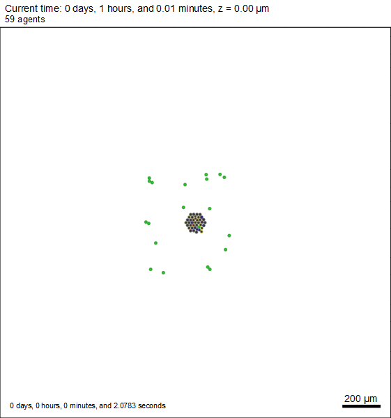

# Requirements

- [PhysiCell V1.8.0 or later](http://physicell.org/downloads/)

- [libvips](https://libvips.github.io/libvips/install.html)
  
- [Pyvips](https://pypi.org/project/pyvips/)

- [Numpy](https://pypi.org/project/numpy/)

# Getting Up and Running

Install PhysiCell [1], and libvips from their download pages.

Make sure to install libvips before pyvips, or pyvips will not install correctly.

Once you're done with that:

    pip install numpy
    pip install pyvips

At the start of the source, make sure to change the value of vipshome to the "bin" folder
in the directory you extracted libvips into. Adding libvips to system path may satisfy these
requirements, but it adds many commands and dlls to path, and is likely to cause problems.

Replace the value of "physicellPath" found in the USER PARAMETERS section to the base PhysiCell 
directory on your computer

# User Parameters

    PhysiCellPath = Path(...)

- Path to PhysiCell implementation. Note: requires V.1.8.0 or greater in order to use csv to place cells


    feeders = int(...)

- Number of feeder cells to place
- Each feeder will have an x and y coordinate, so the input will contain twice as many ints as feeders


    bounds = [[int(..), int(...)]]

- The location bounds for each feeder


    generations = int(...)

- define the total number of generations to simulate
- each generation will run a PhysiCell simulation for each member of its population


    bitVarSize = int(...)

- each variable is represented as a string of bits internally. The variable will be scaled to the bound sizes, but
- this represents how many bits, and thus the acuity, the algorithm will use for each variable


    populationSize = int(...)

- each generation contains a population of different input parameters
- The populationSize controls the number of inputs are generated in each generation 
- PhysiCell will evaluate the fitness of each member of the population with its own simulation
- If populationSize is set to 10, PhysiCell will run 10 simulations in every generation


    crossoverRate = float(...)

- how likely the parents are to mix their genes to form offspring 
- Too low of a value will result in most children being direct copies of their parents


    mutationRate = float(...)

- how likely each bit in a variable is to be flipped when forming the next generation 
- Too high of a value will result in too much chaos and the algorithm will not be able to converge on an ideal solution
- Too low of a value will result in no new genes being introduced


    parentsSelected = int(...)

- the number of parents to select from each generation to seed the next 
- Note that one parent for the next generation will always be the best performing gene, whether or not it came
  from the generation just evaluated

# Output

### Console:

The program will announce the generation it is currently working on, the index of the current gene,
followed by the evaluation, and the input parameters.

Once a generation is computed, the time it took to evaluate the generation is printed, along with information regarding
the best gene of the generation, and the best gene to be recorded from any generation.

Once all generations have run their course, the best score, generation, index, and inputs are printed.

#### Output of a Simple Simulation

```
  Starting generation 0
  initial random population: [0, 1, 1, 1, 1, 1, 0, 1, 1, 0, 1, 0, 0, 0, 0, 1, 0, 1, 0, 1, 0, 0, 0, 1, 0, 1, 0, 1, 0, 1, 1, 0, 0, 1, 0, 1, 0, 0, 1, 1, 0, 0, 0, 0, 1, 0, 1, 0, 1, 0, 0, 1, 1, 0]
    0: evaluation = 99978.2391, coordinates: [(-5, -123), (-118, 101), (-159, -90)]
    1: evaluation = 100269.5587, coordinates: [(204, 169), (-66, 32), (-105, 94)]
    2: evaluation = 100051.3197, coordinates: [(-151, -153), (-67, 139), (-146, 72)]
    3: evaluation = 97685.6336, coordinates: [(-82, -135), (81, 2), (17, -65)]
    4: evaluation = 99978.2391, coordinates: [(-177, 26), (-67, -52), (-225, -255)]
  Generation 0 computed in 14.6317 seconds, generation best = 100269.55873038062, 1: [204, 169, -66, 32, -105, 94]
  Overall best =100269.55873038062, from generation 0, index 1: [204, 169, -66, 32, -105, 94]
  Selected parents: [[1, 1, 1, 0, 0, 1, 1, 0, 0, 1, 1, 0, 1, 0, 1, 0, 0, 1, 0, 1, 0, 1, 1, 1, 1, 1, 0, 1, 0, 0, 1, 0, 0, 0, 0, 0, 0, 1, 0, 0, 1, 0, 1, 1, 1, 1, 0, 1, 0, 1, 1, 1, 1, 0], [0, 0, 1, 1, 0, 1, 0, 0, 1, 0, 0, 1, 1, 0, 0, 1, 1, 1, 0, 1, 0, 1, 1, 1, 1, 0, 1, 1, 1, 0, 0, 0, 1, 0, 1, 1, 0, 0, 1, 1, 0, 1, 1, 1, 0, 1, 0, 1, 0, 0, 1, 0, 0, 0], [0, 0, 1, 0, 0, 1, 1, 1, 1, 1, 0, 0, 0, 1, 1, 0, 1, 0, 0, 1, 0, 1, 1, 1, 1, 0, 1, 0, 1, 1, 0, 0, 1, 1, 0, 0, 0, 0, 0, 0, 1, 1, 1, 1, 1, 0, 0, 0, 0, 0, 0, 0, 0, 1], [1, 1, 1, 0, 0, 1, 1, 0, 0, 1, 1, 0, 1, 0, 1, 0, 0, 1, 0, 1, 0, 1, 1, 1, 1, 1, 0, 1, 0, 0, 1, 0, 0, 0, 0, 0, 0, 1, 0, 0, 1, 0, 1, 1, 1, 1, 0, 1, 0, 1, 1, 1, 1, 0], [0, 0, 1, 1, 0, 1, 0, 0, 1, 0, 0, 1, 1, 0, 0, 1, 1, 1, 0, 1, 0, 1, 1, 1, 1, 0, 1, 1, 1, 0, 0, 0, 1, 0, 1, 1, 0, 0, 1, 1, 0, 1, 1, 1, 0, 1, 0, 1, 0, 0, 1, 0, 0, 0]]
    children: [[1, 1, 1, 0, 0, 1, 1, 0, 1, 0, 0, 1, 1, 0, 0, 1, 1, 1, 0, 1, 0, 1, 1, 1, 1, 0, 1, 1, 1, 0, 0, 0, 1, 0, 1, 1, 0, 0, 1, 1, 0, 1, 1, 1, 0, 1, 0, 1, 0, 0, 1, 0, 0, 0], [0, 0, 1, 1, 0, 1, 0, 0, 0, 1, 1, 0, 1, 0, 1, 0, 0, 1, 0, 1, 0, 1, 1, 1, 1, 1, 0, 1, 0, 0, 1, 0, 0, 0, 0, 0, 0, 1, 0, 0, 1, 0, 1, 1, 1, 1, 0, 1, 0, 1, 1, 1, 1, 0], [0, 0, 1, 0, 0, 1, 1, 1, 1, 1, 0, 0, 0, 1, 1, 0, 1, 0, 0, 1, 0, 1, 1, 1, 1, 0, 1, 0, 1, 1, 0, 0, 1, 1, 0, 0, 0, 0, 0, 0, 1, 0, 1, 1, 1, 1, 0, 1, 0, 1, 1, 1, 1, 0], [1, 1, 1, 0, 0, 1, 0, 0, 0, 1, 1, 0, 1, 0, 1, 0, 0, 1, 0, 1, 0, 1, 1, 1, 1, 1, 0, 1, 0, 0, 1, 0, 0, 0, 0, 0, 0, 1, 0, 0, 1, 1, 1, 1, 1, 0, 0, 0, 0, 0, 0, 0, 0, 1], [0, 0, 1, 1, 0, 1, 0, 0, 1, 0, 0, 1, 1, 0, 0, 1, 1, 1, 0, 1, 0, 1, 1, 1, 1, 0, 1, 1, 1, 0, 0, 0, 0, 0, 0, 0, 0, 1, 0, 0, 1, 0, 1, 1, 1, 1, 0, 1, 0, 1, 1, 1, 1, 0], [1, 1, 0, 0, 0, 1, 1, 0, 0, 1, 1, 0, 1, 0, 1, 0, 0, 1, 0, 1, 0, 1, 1, 1, 1, 1, 0, 1, 0, 0, 1, 0, 1, 0, 1, 1, 0, 0, 1, 1, 0, 1, 1, 1, 0, 1, 0, 1, 0, 0, 1, 0, 0, 0]]
  Starting generation 1
    0: evaluation = 100287.2032, coordinates: [(205, -153), (-67, 139), (-146, 72)]
    1: evaluation = 97685.6336, coordinates: [(-152, 169), (-66, 32), (-105, 94)]
    2: evaluation = 99978.2391, coordinates: [(-177, 26), (-67, -52), (-233, 94)]
    3: evaluation = 99978.2391, coordinates: [(200, 169), (-66, 32), (-97, -255)]
    4: evaluation = 99760.0000, coordinates: [(-151, -153), (-67, 128), (-105, 94)]
    5: evaluation = 97724.3895, coordinates: [(140, 169), (-66, 43), (-146, 72)]
  Generation 1 computed in 19.7677 seconds, generation best = 100287.20323038059, 0: [205, -153, -67, 139, -146, 72]
  Overall best =100287.20323038059, from generation 1, index 0: [205, -153, -67, 139, -146, 72]
  Selected parents: [[1, 1, 1, 0, 0, 1, 1, 0, 1, 0, 0, 1, 1, 0, 0, 1, 1, 1, 0, 1, 0, 1, 1, 1, 1, 0, 1, 1, 1, 0, 0, 0, 1, 0, 1, 1, 0, 0, 1, 1, 0, 1, 1, 1, 0, 1, 0, 1, 0, 0, 1, 0, 0, 0], [0, 0, 1, 0, 0, 1, 1, 1, 1, 1, 0, 0, 0, 1, 1, 0, 1, 0, 0, 1, 0, 1, 1, 1, 1, 0, 1, 0, 1, 1, 0, 0, 1, 1, 0, 0, 0, 0, 0, 0, 1, 0, 1, 1, 1, 1, 0, 1, 0, 1, 1, 1, 1, 0], [1, 1, 1, 0, 0, 1, 0, 0, 0, 1, 1, 0, 1, 0, 1, 0, 0, 1, 0, 1, 0, 1, 1, 1, 1, 1, 0, 1, 0, 0, 1, 0, 0, 0, 0, 0, 0, 1, 0, 0, 1, 1, 1, 1, 1, 0, 0, 0, 0, 0, 0, 0, 0, 1], [1, 1, 1, 0, 0, 1, 1, 0, 1, 0, 0, 1, 1, 0, 0, 1, 1, 1, 0, 1, 0, 1, 1, 1, 1, 0, 1, 1, 1, 0, 0, 0, 1, 0, 1, 1, 0, 0, 1, 1, 0, 1, 1, 1, 0, 1, 0, 1, 0, 0, 1, 0, 0, 0], [0, 0, 1, 0, 0, 1, 1, 1, 1, 1, 0, 0, 0, 1, 1, 0, 1, 0, 0, 1, 0, 1, 1, 1, 1, 0, 1, 0, 1, 1, 0, 0, 1, 1, 0, 0, 0, 0, 0, 0, 1, 0, 1, 1, 1, 1, 0, 1, 0, 1, 1, 1, 1, 0]]
    children: [[1, 0, 1, 0, 0, 1, 1, 1, 1, 1, 0, 0, 0, 1, 1, 0, 1, 0, 0, 1, 0, 1, 1, 1, 1, 0, 1, 0, 1, 1, 0, 0, 1, 1, 0, 0, 0, 0, 0, 0, 1, 1, 1, 1, 1, 1, 0, 1, 0, 1, 1, 1, 1, 0], [0, 0, 1, 0, 0, 1, 1, 0, 1, 0, 0, 1, 1, 0, 0, 1, 1, 1, 0, 1, 0, 1, 1, 1, 1, 0, 1, 1, 1, 0, 0, 0, 1, 0, 1, 1, 0, 0, 1, 1, 0, 1, 1, 1, 0, 1, 0, 1, 0, 0, 1, 0, 0, 0], [1, 1, 0, 0, 0, 1, 0, 0, 0, 1, 1, 0, 1, 0, 1, 0, 0, 1, 0, 1, 0, 1, 1, 1, 1, 1, 0, 1, 0, 0, 1, 0, 0, 0, 0, 0, 0, 1, 0, 0, 1, 1, 1, 1, 1, 0, 0, 0, 0, 0, 0, 0, 0, 1], [1, 1, 1, 0, 0, 1, 1, 0, 1, 0, 0, 1, 1, 0, 0, 1, 1, 1, 0, 1, 0, 1, 1, 1, 1, 0, 1, 1, 1, 0, 0, 0, 1, 0, 1, 1, 0, 0, 1, 1, 0, 1, 1, 1, 0, 1, 0, 1, 0, 0, 1, 0, 0, 0], [0, 0, 1, 0, 0, 1, 1, 1, 1, 1, 0, 0, 0, 1, 1, 0, 1, 0, 0, 1, 0, 1, 1, 1, 1, 0, 1, 0, 1, 1, 0, 0, 1, 1, 0, 0, 0, 0, 0, 0, 1, 1, 1, 1, 0, 1, 0, 1, 0, 0, 1, 0, 0, 0], [1, 1, 1, 0, 0, 1, 1, 0, 1, 0, 0, 1, 1, 0, 0, 1, 1, 1, 0, 1, 0, 1, 1, 1, 1, 0, 1, 1, 1, 0, 0, 0, 1, 0, 1, 1, 0, 0, 1, 1, 0, 0, 1, 1, 1, 1, 0, 1, 0, 1, 1, 1, 1, 0]]
  Done!
  best score: 100287.20323038059, at generation: 1 index: 0 inputs: [205, -153, -67, 139, -146, 72]
```


### Files:

A directory labelled "progress" with subdirectories "bestFinals" and "bestInitials" are created. 

A directory labelled "output" is created in the current working directory. Output contains a sequentially labelled folder
for each generation, "generationbests" and "progressive" output summary folders, and a graph of the fitness evaluations of the
best gene in each population, and a graph containing the best evaluations seen thus far.

Inside each generation folder is a folder with sequentially labelled genes. Each gene folder contains the coords.csv given to
PhysiCell, the evaluation, initial, and final svgs, along with a scatter plot of the initial cell layout.

generationBests and progressive both contain folders called "bestfinals" and "bestInitials".

"bestFinals" contains sequentially labled svg files corresponding to every evaluation that beat the current best,
along with a gif animation of the svgs. "bestInitials" contains analogous svgs and an animation, of the initial states,
along with the corresponding scatter plots.




```
[1] A Ghaffarizadeh, R Heiland, SH Friedman, SM Mumenthaler, and P Macklin,
     PhysiCell: an Open Source Physics-Based Cell Simulator for Multicellu-
     lar Systems, PLoS Comput. Biol. 14(2): e1005991, 2018
     DOI: 10.1371/journal.pcbi.1005991 
```